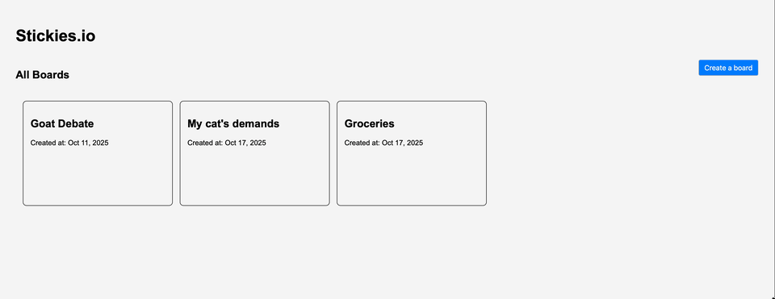

# stickies
a minimalist tool for adding sticky notes to a board.

## tech
htmx + go (using `templ` for components) 

## local development
you will need the following installed:
- go v1.25+
- docker 

### steps
1. copy the example env file and update as needed. run `cp .env.example .env` and edit the new file
2. start a `postgres` instance inside a docker container. `docker-compose.yml` is included for this, run: `docker compose up`
3. start the application: `go run .`

### tips
- when updates are made to `*.templ` files, you will need to regenerate the components to see your changes. to do this, run: `go tool templ generate`
- **pro tip:** alternatively, you can start the application with hot reload for templ components by running the following: `go tool templ generate --watch --proxy="http://localhost:8080" --cmd="go run ."`

## features
- single user support
    - create board (user names the board)
    - create stickies (user enters note content and chooses a color)
    - delete stickies

## working on
- [x] feature: add database 
- [x] styling: menu and boards pages 
- [ ] feature: form validation
- [ ] styling: create board and sticky note forms
- [ ] bug: single form submit creates multiple boards/stickies (expected: single submit should create single sticky/board)
- [ ] bug: no navigation after delete board (expected: should navigate back to menu)

## demo (updated 10/17/25)

